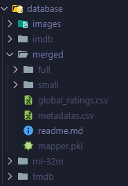
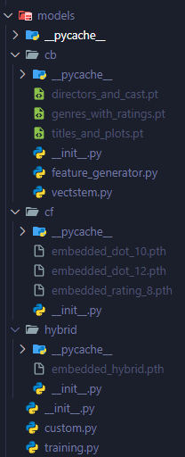

# Movie Recommender

Capstone Project Submission for **IT4142E - Introduction to Data Science**, Hanoi University of Science and Technology.

Project Topic: *Analyzing Movie Ratings for Recommendation*

Supervisor: Prof. Than Quang Khoat

Project report: [Onedrive](https://husteduvn-my.sharepoint.com/:b:/g/personal/dat_tht225482_sis_hust_edu_vn/ETrLko85l9hEo5-lJ34Hu2QBP_KVIQ1-ip4J96khSNFBUw?e=Atxa5g) (pdf).

Training details: [Wandb](https://api.wandb.ai/links/dat-tht225482-hust/4nazuki3).

## Contribution

|             Member             | StudentID |               Project Role               |
| :-----------------------------: | :-------: | :---------------------------------------: |
| Tạ Hồ Thành Đạt `<lead>` | 20225482 | Data Crawling & Analyzing, Model Training |
|        Hoàng Minh Quân        | 20215236 |  Data Crawling & Analyzing, App Building  |

## Requirement

Python dependencies are listed in [dependencies.txt](./requirements.txt).

Dataset and model weights are hosted on [Onedrive](https://husteduvn-my.sharepoint.com/:f:/g/personal/dat_tht225482_sis_hust_edu_vn/EvzkosUBg2xHtBl4hZejPaABc696kWogjRTSmEKATdjiXA?e=xwvaaS). Please download and extract them first for our models and app to work properly.

The final workspace would look like this:

<p float="left" align="center">
  
   
</p>

## Notebooks

```bash
.
├── data-crawl
│   ├── data_correction.ipynb       Update outdated and missing entries
│   ├── data_blending.ipynb         Merge all crawled data from IMDb, TMDb, MovieLens
│   └── data_exploration.ipynb      Analyze the merged dataset
│
└── training                        Training models
    ├── cb_models.ipynb
    ├── cf_models.ipynb
    └── hybrid_models.ipynb
```

## Data Reduction

Run [data_reduction.ipynb](./data_reduction.ipynb) to generate a smaller dataset.

The new dataset will be stored as [database/merged/small](./database/merged/small).

## Demo

Code example on how to use our model can be found in [demo.ipynb](./demo.ipynb).

For app demo using streamlit, run 

## Citation

Data sources used for this project:

- MovieLens Datasets: F. Maxwell Harper and Joseph A. Konstan. 2015. The MovieLens Datasets: History and Context. ACM Transactions on Interactive Intelligent Systems (TiiS) 5, 4: 19:1–19:19. https://doi.org/10.1145/2827872

- Movie metadata, including release dates, runtime... is crawled from The Internet Movie Database (IMDb) and The Movie Database (TMDb).
